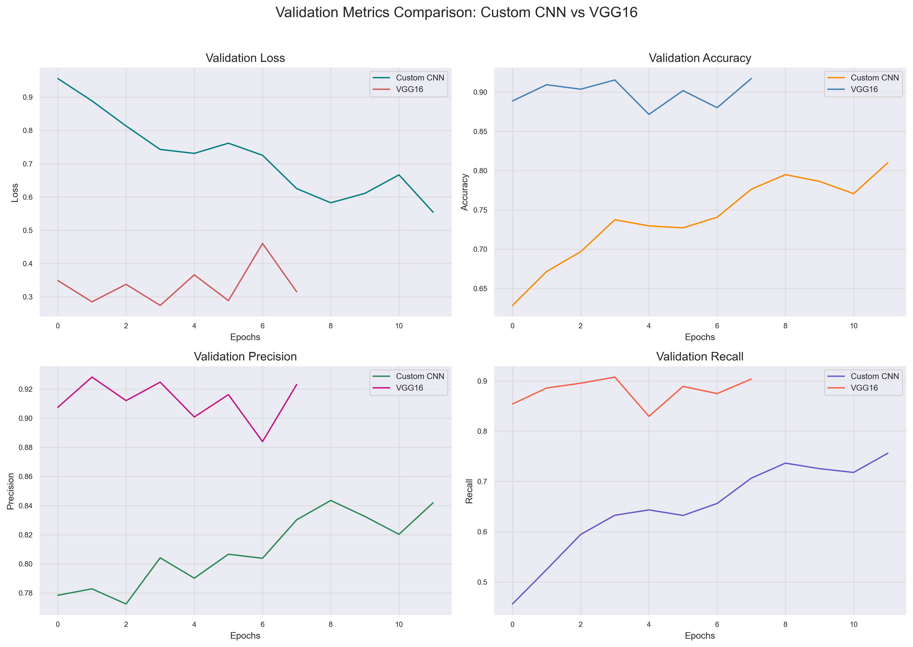
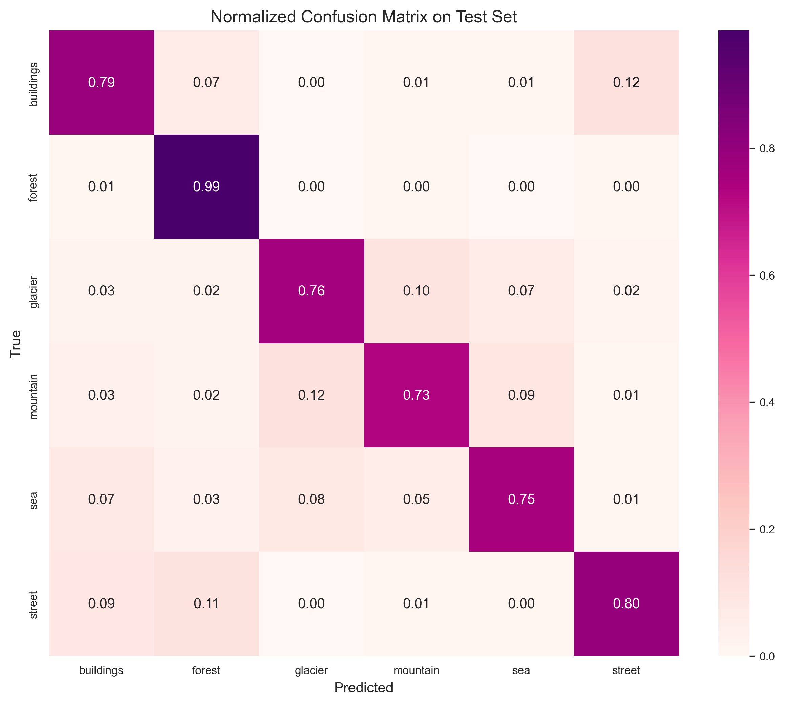
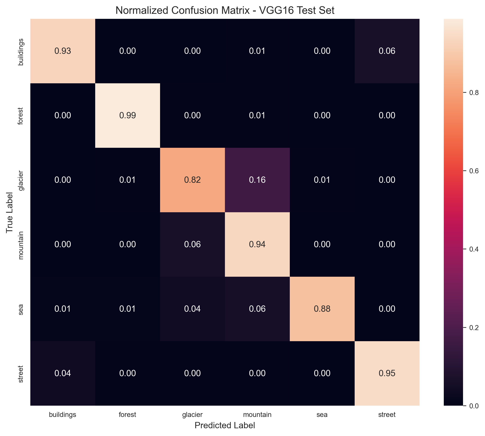

> A complete comparison of a custom CNN and VGG16 on a real-world image dataset — built, trained, and evaluated from scratch in TensorFlow/Keras.

# Natural Scenes Classification Using CNNs

This project explores the use of convolutional neural networks to classify natural scene images into six categories. It begins with building a custom CNN model to handle this multiclass image classification task, then compares it to a pretrained VGG16 model. The goal is to evaluate trade-offs between custom and transfer learning approaches in terms of accuracy, generalization, training time, and architectural flexibility, all in the context of real-world data.

## Dataset Description

This project uses the [Intel Image Classification](https://www.kaggle.com/datasets/puneet6060/intel-image-classification) dataset from Kaggle, which contains around **25,000 images** of natural scenes from around the world.

The images are organized into six distinct categories:

- Buildings
- Forest
- Glacier
- Mountain
- Sea
- Street

  The dataset is split into three subsets:

- **Training:** ~14,000 images
- **Testing:** ~3,000 images
- **Prediction:** ~7,000 images

Each image is a color photograph of outdoor scenery, and the classes represent high-level visual categories that vary in texture, lighting, and composition — making it a strong candidate for evaluating image classification models.

Note: The “prediction” set included in the dataset was not used, as it does not contain ground-truth labels.

## Model Architectures

### Custom CNN

The custom model consists of a 7-layer architecture designed for feature extraction and classification:

- **Convolutional Stack:**

  - 3 × Conv2D + MaxPooling layers with increasing filter sizes (32, 64, 128)
  - Designed to capture low-, mid-, and high-level features

- **Classification Head:**
  - Flatten → Dense (ReLU) → Dropout → Dense (Softmax)
  - Includes dropout for regularization and a softmax layer for multiclass prediction

This model was built from scratch and trained on the dataset to serve as a baseline for comparison.

The custom CNN was trained in two phases. Initially, it showed signs of overfitting and limited generalization, so the architecture was retrained with:

- A higher dropout rate to reduce overfitting
- An increased number of training epochs to allow more time for learning general patterns

This adjustment improved validation performance, though the custom model still trailed behind VGG16 in both accuracy and generalization.

### VGG16 (Transfer Learning)

The second model uses a pretrained VGG16 network with ImageNet weights. To adapt it for the current classification task:

- The convolutional base was mostly frozen, except for the last 4 layers, allowing fine-tuning.
- A custom classification head was added:
  - GlobalAveragePooling2D → Dense (ReLU) → Dropout → Dense (Softmax)

Despite being trained for fewer epochs (8 vs. 12), the pretrained model converged faster and outperformed the custom CNN on both the training and test sets

## Training & Evaluation Summary

Both models were trained using the RMSprop optimizer and categorical crossentropy loss, appropriate for this multi-class classification task. The custom CNN was trained in two phases: initially for 6 epochs, then retrained for 12 epochs with increased dropout to improve generalization. The VGG16 model was trained for 8 epochs from the start. A batch size of 64 was used for both models.

To preserve the best weights during training, both models used a `ModelCheckpoint` callback, saving the state with the lowest validation loss — typically the point of peak generalization before overfitting began.

On the test set, the final custom CNN reached **80% accuracy**, while the VGG16 model achieved **91% accuracy**. Precision and recall followed a similar trend, with VGG16 outperforming the custom model across all tracked metrics.

Training and validation plots highlight the performance gap between the two models. While the custom CNN trained faster and showed steady improvement, its performance dropped noticeably on unseen test data, suggesting overfitting. While VGG16 has significantly more parameters, it converged quickly and maintained consistent validation performance — highlighting the strength of transfer learning in this context.

**See the comparison plot below for full accuracy, loss, precision, and recall curves during validation.**

## Key Results (with Plots)

In terms of raw performance, the pretrained VGG16 model significantly outperformed the custom CNN across all major metrics. VGG16 exceeded the custom model by over 10% in accuracy and precision, and by 15% in recall — highlighting its effectiveness in feature extraction and generalization.

The validation metrics plot shows that VGG16 started with strong performance and plateaued early, converging after just four epochs. This quick stabilization demonstrates how transfer learning reduces training time while achieving high performance. In contrast, the custom CNN showed steady improvement but required more training and still fell short on most metrics.

The confusion matrices reinforce this trend. The custom CNN consistently misclassified glaciers as mountains and streets as buildings, revealing its struggle to separate visually similar classes. VGG16 showed clearer class separation across all six categories, though both models struggled with background interference in glacier, sea, and mountain images — likely due to shared visual features. Notably, VGG16 handled these distractions better, with fewer misclassifications in ambiguous scenes.

VGG16's test performance closely mirrored its validation results, with the exception of slight accuracy drops in glacier (−8%) and sea (−6%) classes — consistent with earlier misclassification patterns observed throughout training.

### Confusion Matrices

**Custom CNN – Test Set**

**VGG16 – Test Set**

## How to Run

### Requirements

- Python 3.x
- JupyterLab or Jupyter Notebook (recommended for rendering code outputs and plots)
- TensorFlow, Keras, NumPy, Matplotlib, and other libraries listed in `requirements.txt`

### Running the Notebook

- Open the notebook in JupyterLab or Jupyter Notebook.
- **Run one cell at a time** rather than using "Run All" — especially during training sections — to avoid overwhelming your system.
- Train **one model at a time** (either the custom CNN or VGG16) to conserve resources.
- If you’re short on time or GPU power, reduce the number of epochs for VGG16 (e.g., from 8 to 5), as it typically converges early.

### Optional: Extending the Evaluation

- After testing on the labeled test set, you can experiment with the unlabeled prediction set included in the dataset.
- Try running your trained model on these unseen images to visually inspect its predictions and evaluate its generalization beyond ground-truth labels.

## Future Work & Improvements

While VGG16 performed well overall, future iterations could explore newer architectures such as ResNet50 to push performance further. Training time could also be optimized by adding an early stopping callback — VGG16, for example, plateaued after the fourth epoch, making the full 12-epoch run unnecessary in hindsight.

Additional data augmentation techniques may help reduce overfitting and improve generalization, particularly for classes with high visual overlap like glacier and mountain. Both models showed a tendency to rely on background features, which led to misclassifications when those features appeared across multiple classes.

Finally, incorporating class activation visualizations (e.g., Grad-CAM) would provide deeper insight into what each model is focusing on during classification. These visualizations could help inform more targeted architectural or data-based adjustments in future versions of the project.

## Credits & License

**Dataset**: [Intel Image Classification Dataset](https://www.kaggle.com/datasets/puneet6060/intel-image-classification) by Puneet Bansal on Kaggle

**Libraries Used**:

- TensorFlow / Keras
- NumPy, Pandas
- Matplotlib, Seaborn
- scikit-learn
- OpenCV (cv2)
- Pillow (PIL)
- **Author**: Developed by Noëlla Sangwa — built as a personal learning project and portfolio piece to explore CNNs and transfer learning in computer vision.

  **License**:  
  This project is licensed under the [MIT License](LICENSE).
 
